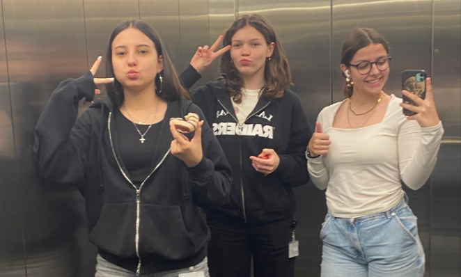

# Basislehrjahr 2024

Das hier ist ein Repository für die Ablage meiner Aufgaben   und Projekte, die ich im 2. Halbjahr des ersten Lehrjahres   erledigt habe.

## Inhaltsverzeichnis

- [Über mich](#über-mich)
- [Projekte und Aufgaben](#projekte-und-aufgaben)
- [Mitwirkende](#mitwirkende)

## Über mich

Ich bin Nina Bisevac und befinde mich im ersten Lehrjahr als Plattformentwicklerin bei NoserYoung. Mit meinen 16 Jahren geniesse ich es, in meiner Freizeit nach draussen zu gehen oder das Fitnessstudio zu besuchen. Besonders viel Freude bereitet mir die Arbeit an Projekten im Betrieb, da ich mich gerne neuen Herausforderungen stelle und daran wachse. In diesem Repository findest man einige meiner Arbeiten. Viel Spass beim Anschauen!

## Projekte und Aufgaben
Alle Projekte und Aufgaben findet man unter dem Ordner "Projects"

- `DMZ`: Betriebsdokumentation des DMZ-Auftrags.
- `HTML`: Verschiedene Codes zu HTML-Aufträgen.
- `Java`: Verschiedene Codes zu Java-Aufträgen.
- `Markdown`: Markdown-Grundlagen und Tests.
- `PowerShell`: Verschiedene PowerShell-Skripte.
- `VPN`: Betriebsdokumentation des VPN-Auftrags.

## Mitwirkende

Personen die Oft Mitgewirkt haben:

- [Anna Nell](https://github.com/Anna-Nell)
- [Naemi Ross](https://github.com/naemi-r)

